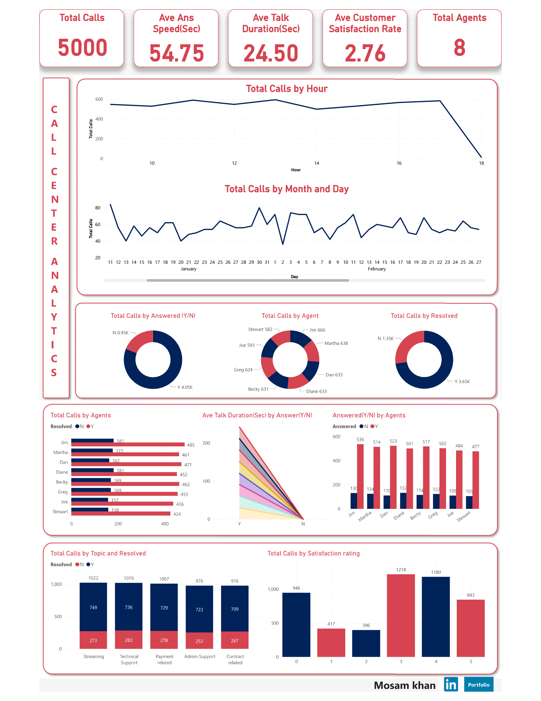

# Call Center Performance Dashboard

## Problem Statement
- **Problem:** The manager at PhoneNow, a big telecom company, is seeking transparency and insight into the Call Center dataset to gain an accurate overview of long-term customer and agent behavior trends.
- **Objective:** Create a Power BI dashboard reflecting all relevant Key Performance Indicators (KPIs) and metrics:
  - Self-exploratory call trends
  - Overview of agent performance and behaviors
  - Overview of customer satisfaction
  - Many metrics and plots for discussion and further analysis
  - Minimal interaction required

### Possible KPIs
- Overall customer satisfaction
- Calls answered/abandoned
- Calls by time
- Average speed of answer
- Agents' performance quadrant: average handle time vs calls answered
## Dashboard

## Analysis and Insights
### Call Trends
- Customers tend to call more between 5:00 pm - 5:30 pm, with 18.40% abandoned rate, mainly in the middle of the month.
- The highest abandoned rate (28.03%) occurs between 1:00 pm - 1:30 pm.
- Predominant issues with Streaming service.
- High resolved rate (89.94%).

### Agent Performance
- Becky satisfies customers most with a 12.02% "Very good" rating.
- Jim has the highest resolved rate and excels in "Contract related" and "Admin Support" issues.

### Customer Satisfaction
- Average satisfaction is 3.40, mainly from "Average" (30.04%) and "Good" (29.11%) ratings.
- Strong positive correlation between calls answered and resolved, boosting satisfaction.

## Recommendations/Results
- Focus on maintaining high customer satisfaction through continuous agent training and development.
- Monitor call volume by time to appropriately staff the call center during peaks.
- Provide targeted support and training to struggling agents.

## Tools and Technologies Used
- Excel: Data cleaning and manipulation
- Power BI: Dashboard and visualization
- DAX: Calculations

## Conclusion
The call center dashboard offers valuable insights, aiding informed decision-making and resource allocation for the client. It effectively identifies areas for improvement.
